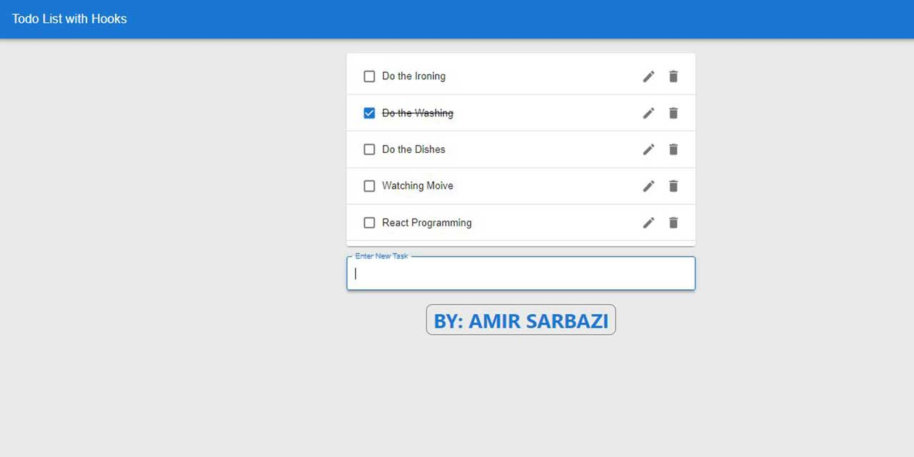

<div>
  <h1 align="center">A Todo List App with React Hooks 🧑‍💻</h1>
<h2>Goals</h2>
  <ul>
  <li>
  Using entirely hooks and functional components.
  </li>
  <li>
  To Do List application of full (C.R.U.D) to do list
  </li>
  <li>
    No class based components.
    </li>
     <li>
   Looks best on a small screen size (responsive).
    </li>
    
   </ul>

  <p>
    Screenshot:
  </p>

  <a href="">
    
  </a>
</div>

<hr />

## Requirements
- NPM
- React
- React-dom
- MUI
- uuid

## Main Components
- TaskApp
- TaskList
- TaskForm
- TaskEditForm
- Task
- /Hooks/useInput (Tools)
- /Hooks/useToggle (Tools)

## TaskApp Component
This is the main App which renders TaskList and also contains all important functions:

```javascript
addTask()
deleteTask()
toggleTask()
editTask()
```

Moreover, Navigation bar created here by using MUI:
```javascript
      <AppBar position="static">
        <Toolbar>
          <Typography variant="h6" component="div">
            Todo List with Hooks
          </Typography>
        </Toolbar>
      </AppBar>
```

And also renders TaskForm at the bottom for adding new task:

```javascript
  <Grid sx={{ mt: "1.5rem" }} container justifyContent={"center"}>
        <Grid item xs={12} md={8} lg={4}>
          <TaskList
            tasks={tasks}
            deleteTask={deleteTask}
            toggleTask={toggleTask}
            editTask={editTask}
          />
          <TaskForm addTask={addTask} />
        </Grid>
  </Grid>
```


## TaskList Component
Get tasks from props and render each task:
```javascript
   <List>
        {props.tasks.map((t) => (
          <>
            <Task
              item={t}
              key={t.id}
              deleteTask={props.deleteTask}
              toggleTask={props.toggleTask}
              editTask={props.editTask}
            />
            <Divider />
          </>
        ))}
    </List>
```

## Task Component
Renders each task and handle edit/delete/done.
When we click on edit button, TaskEditForm will show up.

```javascript
      <Checkbox tabIndex={-1} checked={item.finished} onClick={handleToggle} />
      <ListItemText
        style={{
          cursor: "context-menu",
          textDecoration: item.finished ? "line-through" : "none",
        }}
      >
        {" "}
        {!showEdit ? (
          item.taskName
        ) : (
          <TaskEditForm
            editTask={editTask}
            handleEdit={handleEdit}
            item={item}
            showEdit={showEdit}
          />
        )}
      </ListItemText>
```

## Additional Component - useInput
Instead of writing handleChange for each InputBox, we can use it easily.
This component helps us to have our input and handle function:

```javascript
 const [taskName, handleTaskNameChange] = useInput(props.item.taskName);
```
## Additional Component - useToggle

No need to write a toggle function for each item, we can easily use this:

```javascript
  const [showEdit, setToggle] = useToggle(false);
```


# Getting Started with Create React App

This project was bootstrapped with [Create React App](https://github.com/facebook/create-react-app).

## Available Scripts

In the project directory, you can run:

### `npm start`

Runs the app in the development mode.\
Open [http://localhost:3000](http://localhost:3000) to view it in your browser.

The page will reload when you make changes.\
You may also see any lint errors in the console.

### `npm test`

Launches the test runner in the interactive watch mode.\
See the section about [running tests](https://facebook.github.io/create-react-app/docs/running-tests) for more information.

### `npm run build`

Builds the app for production to the `build` folder.\
It correctly bundles React in production mode and optimizes the build for the best performance.

The build is minified and the filenames include the hashes.\
Your app is ready to be deployed!

See the section about [deployment](https://facebook.github.io/create-react-app/docs/deployment) for more information.

### `npm run eject`

**Note: this is a one-way operation. Once you `eject`, you can't go back!**

If you aren't satisfied with the build tool and configuration choices, you can `eject` at any time. This command will remove the single build dependency from your project.

Instead, it will copy all the configuration files and the transitive dependencies (webpack, Babel, ESLint, etc) right into your project so you have full control over them. All of the commands except `eject` will still work, but they will point to the copied scripts so you can tweak them. At this point you're on your own.

You don't have to ever use `eject`. The curated feature set is suitable for small and middle deployments, and you shouldn't feel obligated to use this feature. However we understand that this tool wouldn't be useful if you couldn't customize it when you are ready for it.

## Learn More

You can learn more in the [Create React App documentation](https://facebook.github.io/create-react-app/docs/getting-started).

To learn React, check out the [React documentation](https://reactjs.org/).

### Code Splitting

This section has moved here: [https://facebook.github.io/create-react-app/docs/code-splitting](https://facebook.github.io/create-react-app/docs/code-splitting)

### Analyzing the Bundle Size

This section has moved here: [https://facebook.github.io/create-react-app/docs/analyzing-the-bundle-size](https://facebook.github.io/create-react-app/docs/analyzing-the-bundle-size)

### Making a Progressive Web App

This section has moved here: [https://facebook.github.io/create-react-app/docs/making-a-progressive-web-app](https://facebook.github.io/create-react-app/docs/making-a-progressive-web-app)

### Advanced Configuration

This section has moved here: [https://facebook.github.io/create-react-app/docs/advanced-configuration](https://facebook.github.io/create-react-app/docs/advanced-configuration)

### Deployment

This section has moved here: [https://facebook.github.io/create-react-app/docs/deployment](https://facebook.github.io/create-react-app/docs/deployment)

### `npm run build` fails to minify

This section has moved here: [https://facebook.github.io/create-react-app/docs/troubleshooting#npm-run-build-fails-to-minify](https://facebook.github.io/create-react-app/docs/troubleshooting#npm-run-build-fails-to-minify)
